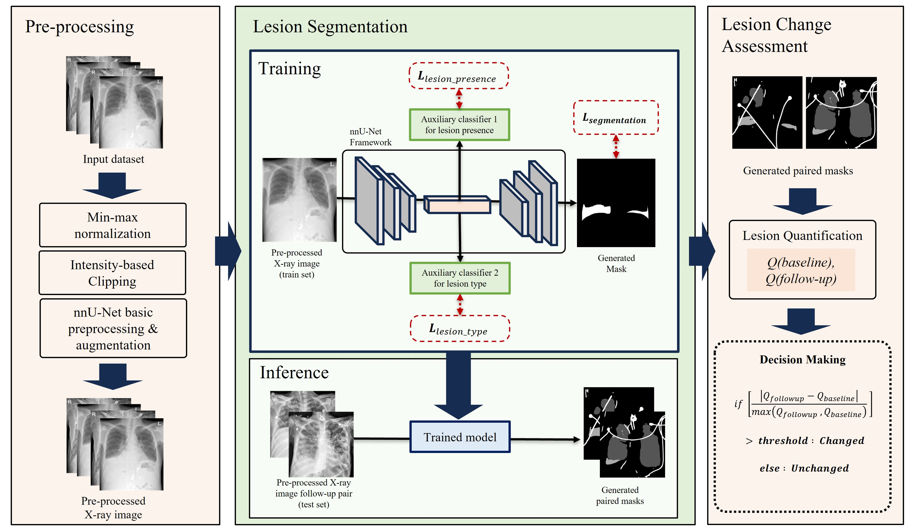

# Automated evaluation of pulmonary lesion changes on chest radiograph during follow-up using semantic segmentation

- **Institution**: [MI2RL](https://www.mi2rl.co/), Asan Medical Center, South Korea  
- **Project**: Automated evaluation of pulmonary lesion changes on chest radiograph during follow-up using semantic segmentation  

  

---

### Publication
[Automated evaluation of pulmonary lesion changes on chest radiograph during follow-up using semantic segmentation (DIR 2026)](https://www.dirjournal.org/articles/automated-evaluation-of-pulmonary-lesion-changes-on-chest-radiograph-during-follow-up-using-semantic-segmentation/doi/dir.2025.253567)

---

### Author Affiliations

- **Youngjae Kim**† — Department of Biomedical Engineering (AMIST) & Department of Convergence Medicine, Asan Medical Center, University of Ulsan College of Medicine, Seoul, Republic of Korea  
- **Yura Ahn**†, MD — University of Ulsan Faculty of Medicine, Department of Radiology and Research Institute of Radiology, Asan Medical Center, Seoul, Republic of Korea
- **Han Na Noh** — University of Ulsan Faculty of Medicine, Health Screening and Promotion Center, Asan Medical Center, Seoul, Republic of Korea
- **Jongjun Won** — University of Ulsan Faculty of Medicine, Department of Convergence Medicine, Asan Medical Institute of Convergence Science and Technology, Asan Medical Center, Seoul, Republic of Korea
- **Chaewon Kim** — University of Ulsan Faculty of Medicine, Department of Convergence Medicine, Asan Medical Institute of Convergence Science and Technology, Asan Medical Center, Seoul, Republic of Korea
- **Sang Min Lee**, MD, PhD — University of Ulsan Faculty of Medicine, Department of Radiology and Research Institute of Radiology, Asan Medical Center, Seoul, Republic of Korea
- **Hyunna Lee**, PhD* — Bigdata Research Center, Asan Institute for Life Science, Asan Medical Center, Seoul, Republic of Korea <hyunnalee@gmail.com>  

† Equal contribution · *Corresponding author
